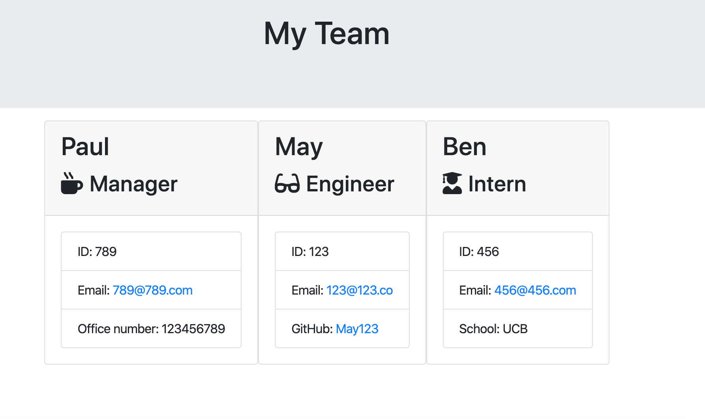
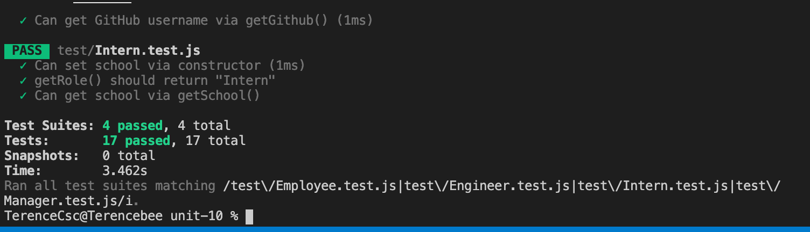
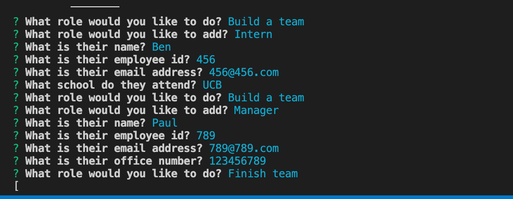
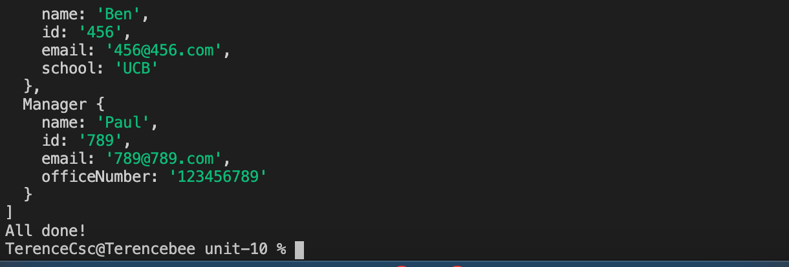

# This is the link to the github repo:

https://github.com/SINCHOCHAN/unit-10


# This is the link to the live website:

https://sinchochan.github.io/unit-10/ 

# How to run (screenshot)




# PROJECT TITLE
Unit 10 OOP Homework: Template Engine - Employee Summary

One of the most important aspects of programming is writing code that is readable, reliable, and maintainable. Oftentimes, *how* we design our code is just as important as the code itself. In this homework assignment, your challenge is to build a Node CLI that takes in information about employees and generates an HTML webpage that displays summaries for each person. Since testing is a key piece in making code maintainable, you will also be ensuring that all unit tests pass.


## Instructions

You will build a software engineering team generator command line application. The application will prompt the user for information about the team manager and then information about the team members. The user can input any number of team members, and they may be a mix of engineers and interns. This assignment must also pass all unit tests. When the user has completed building the team, the application will create an HTML file that displays a nicely formatted team roster based on the information provided by the user. Following the [common templates for user stories](https://en.wikipedia.org/wiki/User_story#Common_templates), we can frame this challenge as follows:

```
As a manager
I want to generate a webpage that displays my team's basic info
so that I have quick access to emails and GitHub profiles
```


There are also unit tests to help you build the classes necessary.

It is recommended that you follow this workflow:

1. Run tests
2. Create or update classes to pass a single test case
3. Repeat

🎗 Remember, you can run the tests at any time with `npm run test`

It is recommended that you start with a directory structure that looks like this:

```
lib/           // classes and helper code
output/        // rendered output
templates/     // HTML template(s)
test/          // jest tests
  Employee.test.js
  Engineer.test.js
  Intern.test.js
  Manager.test.js
app.js         // Runs the application
```
# How to run (screenshot)




### Classes
The project must have the these classes: `Employee`, `Manager`, `Engineer`,
`Intern`. The tests for these classes in the `tests` directory must all pass.

The first class is an `Employee` parent class with the following properties and
methods:

  * name
  * id
  * email
  * getName()
  * getId()
  * getEmail()
  * getRole() // Returns 'Employee'

The other three classes will extend `Employee`. 

In addition to `Employee`'s properties and methods, `Manager` will also have:

  * officeNumber

  * getRole() // Overridden to return 'Manager'

In addition to `Employee`'s properties and methods, `Engineer` will also have:

  * github  // GitHub username

  * getGithub()

  * getRole() // Overridden to return 'Engineer'

In addition to `Employee`'s properties and methods, `Intern` will also have:

  * school 

  * getSchool()

  * getRole() // Overridden to return 'Intern'

### User input

The project must prompt the user to build an engineering team. An engineering
team consists of a manager, and any number of engineers and interns.

### Roster output

The project must generate a `team.html` page in the `output` directory, that displays a nicely formatted team roster. Each team member should display the following in no particular order:

  * Name

  * Role

  * ID

  * Role-specific property (School, link to GitHub profile, or office number)

# How to run (screenshot)



